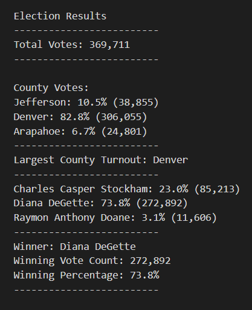
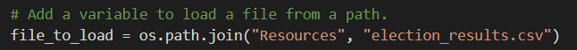
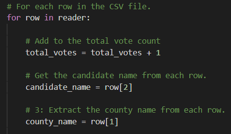

# Election_Analysis

## Project Overview
The purpose of this project was to assist a Colorado Board of Elections employee with auditing the results of a recent local congressional election. The objective was to:

1. Calculate the total number of votes cast.
2. Get a complete list of candidates who received votes.
3. Calculate the total number of votes each candidate received.
4. Calculate the percentage of votes each candidate won.
5. Determine the winner of the election based on popular vote.

## Resources
- Data Source: [election_results.csv](Resources/election_results.csv)
- Software: Python 3.7.6, Visual Studio Code 1.51.1

## Summary
The analysis of the election show that:

- There were 369,711 votes cast in the election.
- The candidate results were:
    - Candidate Charles Casper Stockham received 85,213 votes; 23.0% of the vote.
    - Candidate Diana DeGette received 272,892 votes; 73.8% of the vote.
    - Candidate Raymon Anthony Doane received 11,606 votes; 3.1% of the vote.
- The winner of the election was:
    - Winner: Diana DeGette, who received 272,892 votes; 73.8% of the vote.

## Challenge Overview
After determining the winner of the election, the Colorado Board of Elections needed to know how each county performed. The objective was to:

1. Calculate the total number of voters from each county.
2. Calculate the percentage of voters in each county.
3. Determine the largest county turnout.

## Challenge Summary

### Election-Audit Results

- The county results were:
    - Jefferson received 38,855 votes; 10.5% of the vote.
    - Denver received 306,055 votes; 82.8% of the vote.
    - Arapahoe received 24,801 votes; 6.7% of the vote.
- County with the largest number of votes:
    - Denver had the largest number of votes with 306,055 votes.

### Election-Audit Summary

The script can be modified in various ways to work for other election analysis. For example, a easy modification is to change the "election_results.csv" file as pictured below.

Another change could be to add additional data to analysis. For example, in the audit above, we focused on candidates and counties. What if we needed to narrow down votes to cities? This can be done by adding code to extract city data under "for row in reader:"i.e., city_name = row[x]

